## Thông tin sinh viên
- Họ tên: Phùng Đăng Khoa
- MSSV: 51.01.104.046
- Lớp: 51.01.CNTT.A

## Mô tả
Ứng dụng Console C# quản lý sinh viên theo phương pháp Lập trình hướng đối tượng (OOP). Dự án áp dụng các kiến thức về Class, Kế thừa (Inheritance), Property, Constructor, quản lý tập hợp dữ liệu bằng `List<T>` và truy vấn dữ liệu cơ bản với LINQ.

## Chức năng
Chương trình hoạt động dựa trên Menu điều khiển trong Console với các tính năng:
1. **Thêm sinh viên**: Nhập thông tin (Mã SV, Họ tên, Ngày sinh, Mã lớp, Điểm TB). Có bắt lỗi dữ liệu đầu vào
2. **Xuất danh sách**: In toàn bộ thông tin sinh viên kèm theo Xếp loại học lực (Giỏi, Khá, Trung bình, Yếu).
3. **Tìm sinh viên theo mã**: Nhập mã và hiển thị thông tin chính xác.
4. **Tìm sinh viên theo tên**: Tìm kiếm tương đối các sinh viên có chứa từ khóa họ tên.
5. **Sửa điểm trung bình**: Cập nhật lại điểm cho sinh viên dựa trên mã SV.
6. **Xóa sinh viên**: Xóa sinh viên khỏi danh sách theo mã.
7. **Sắp xếp theo điểm giảm dần**: Sử dụng LINQ để sắp xếp danh sách.
8. **Lọc sinh viên đạt**: Hiển thị danh sách các sinh viên có điểm trung bình $\ge$ 5.0.
0. **Thoát**: Dừng chương trình.

## Cấu trúc thư mục (OOP)
- `Nguoi.cs`: Class cha chứa thông tin cơ bản (Họ tên, Ngày sinh).
- `SinhVien.cs`: Class con kế thừa từ `Nguoi`, bổ sung Mã SV, Lớp, Điểm và logic xếp loại.
- `QuanLySinhVien.cs`: Class dịch vụ (Service) chứa `List<SinhVien>` và các phương thức xử lý (Thêm, Sửa, Xóa, Tìm kiếm, LINQ).
- `Program.cs`: Chứa hàm `Main`, điều khiển menu và tương tác với người dùng.

## Cách chạy
- Mở file `Lab03_QuanLySinhVienOOP.sln` bằng Visual Studio.
- Nhấn `F5` (hoặc nút Start) để build và chạy ứng dụng.
- Tương tác với chương trình bằng cách nhập các số từ `0` đến `8` trên cửa sổ Console.

## Hình ảnh minh họa
0. Giao diện
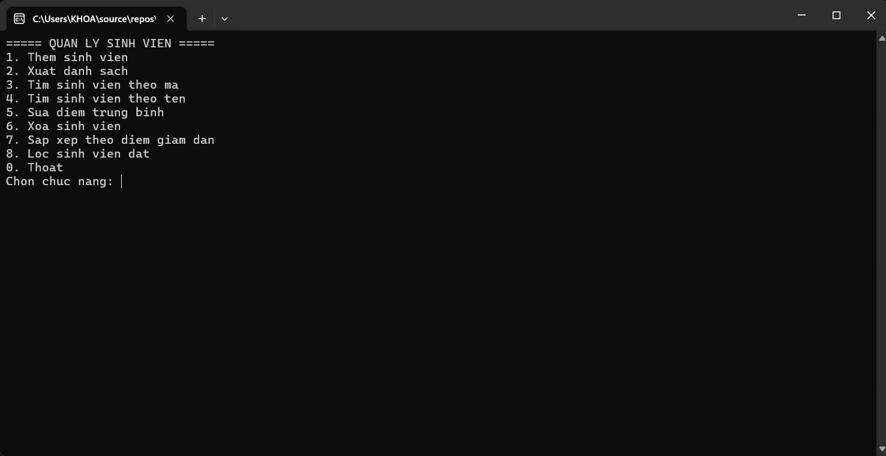
1. Thêm sinh viên
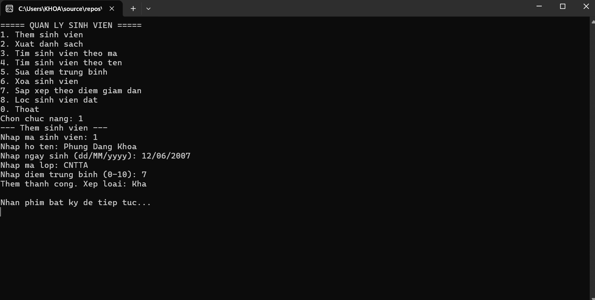
2. Xuất danh sách
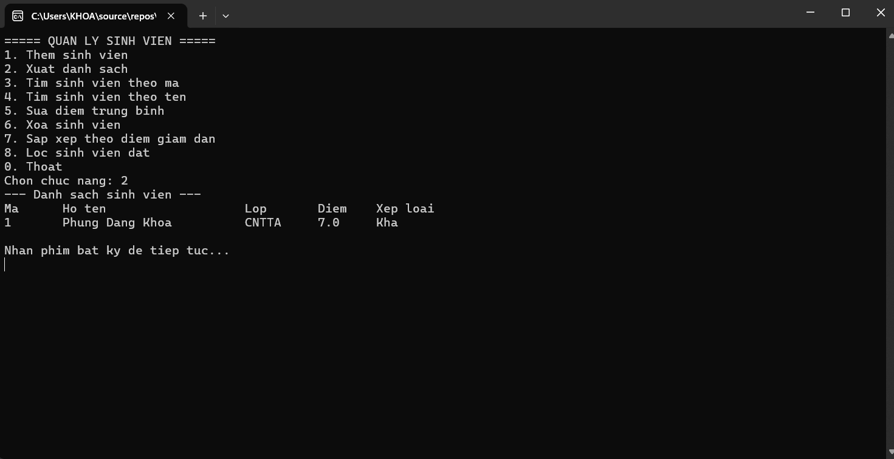
3. Tìm sinh viên theo mã
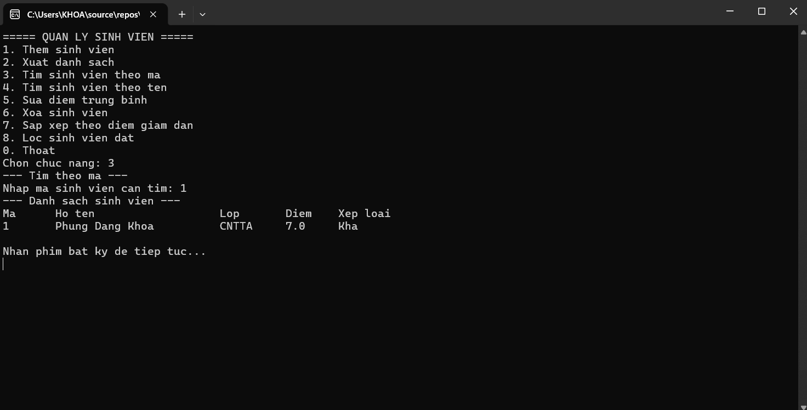
4. Tìm sinh viên theo tên
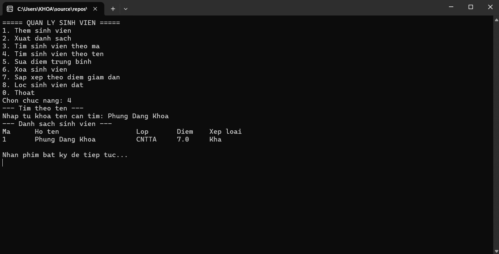
5. Sửa điểm trung bình
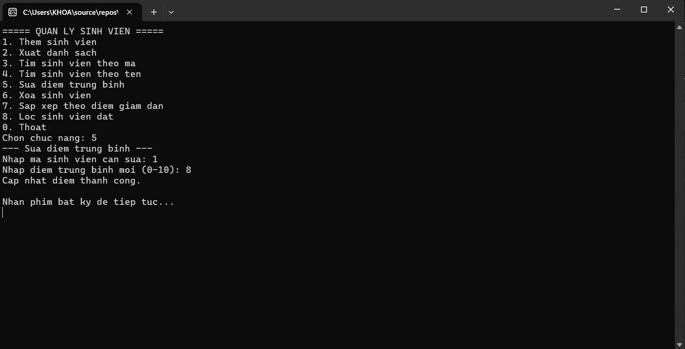
6. Xóa sinh viên
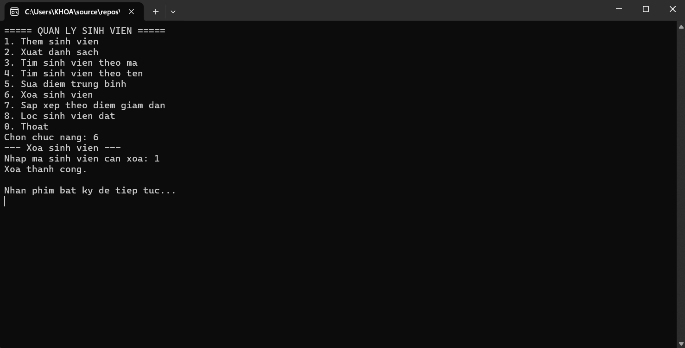
7. Sắp xếp theo điểm giảm dần
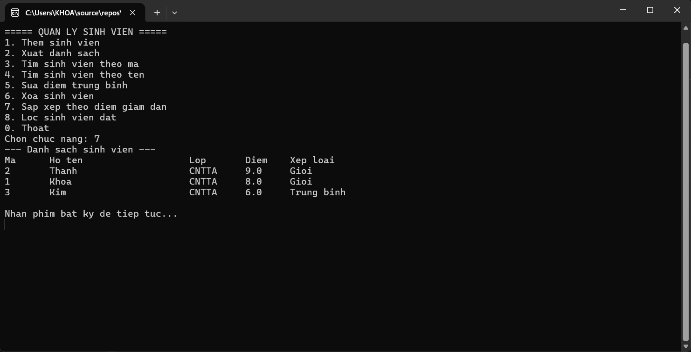
8. Lọc sinh viên đã đạt
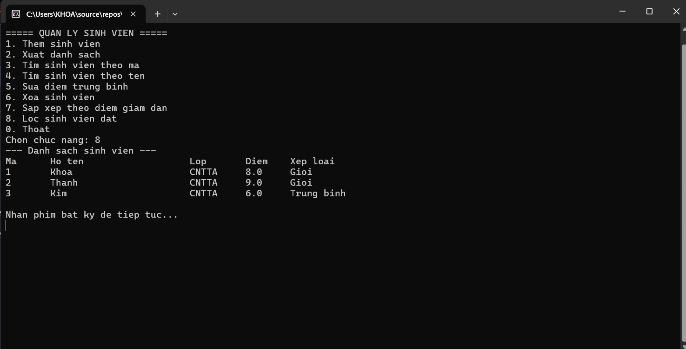
9. Các lỗi
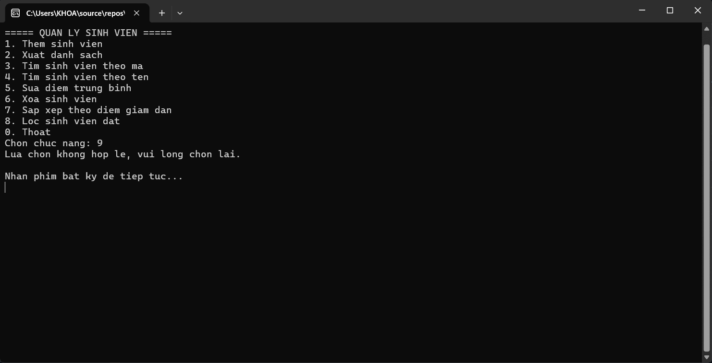
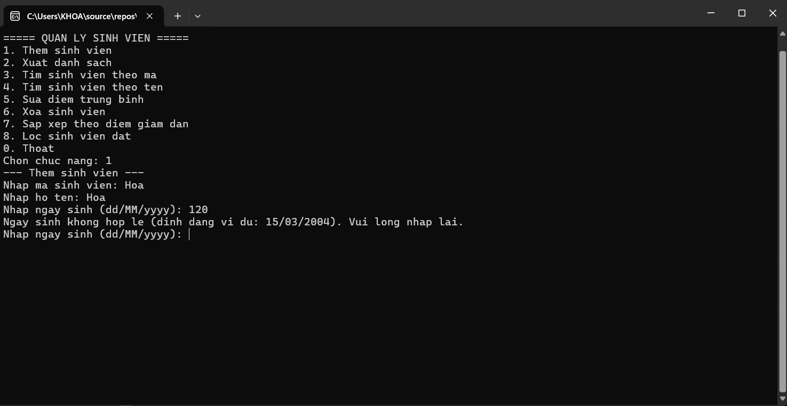
