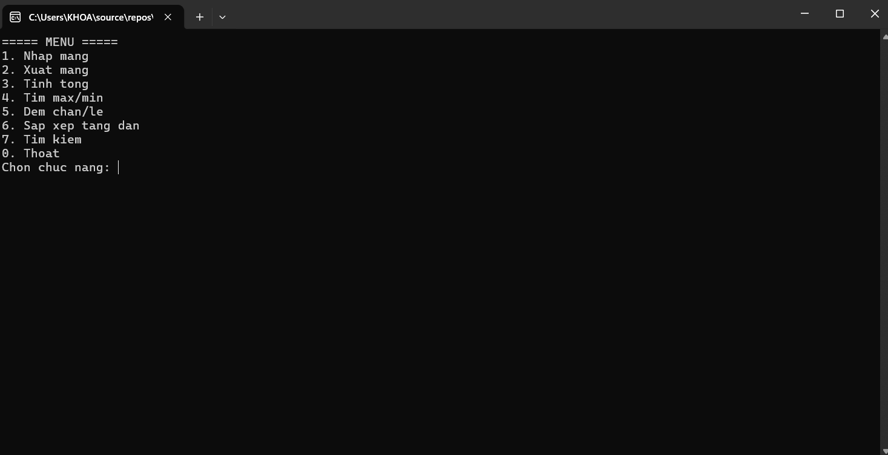
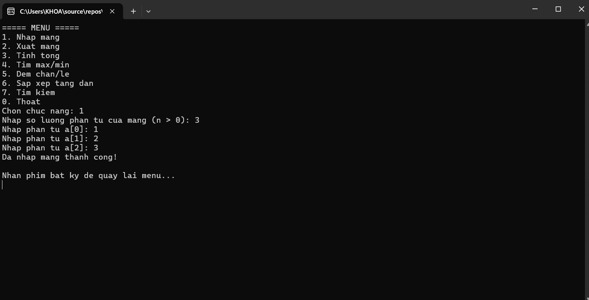
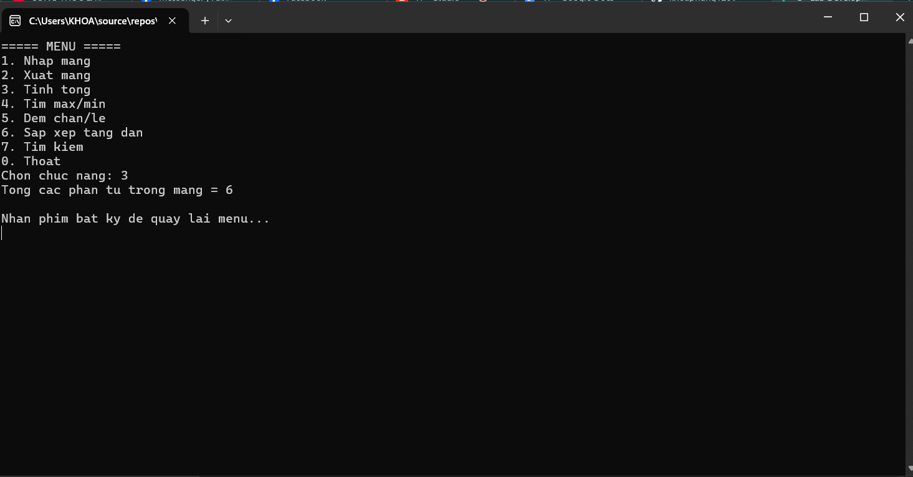
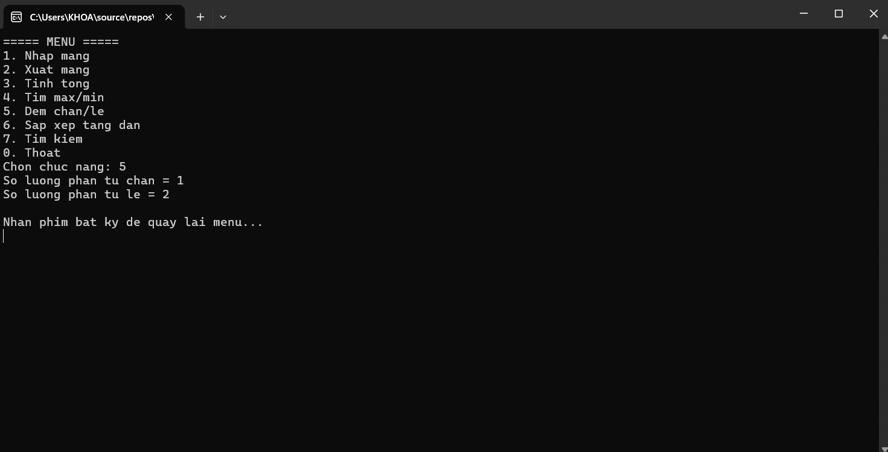
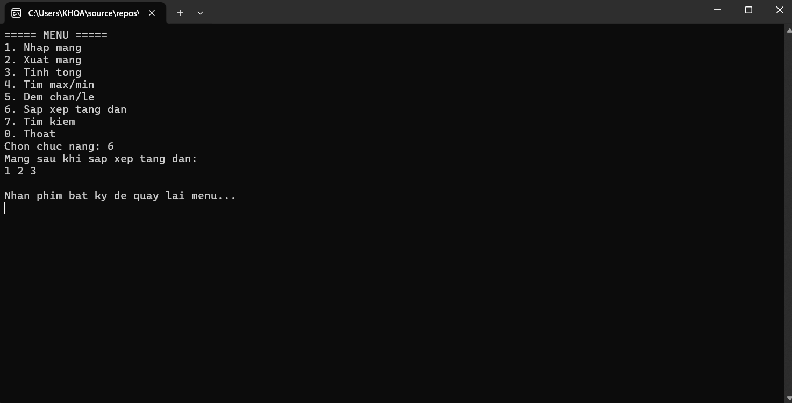
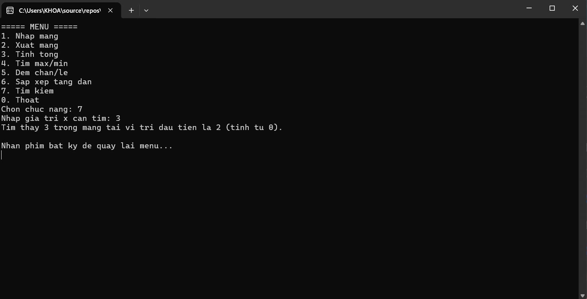
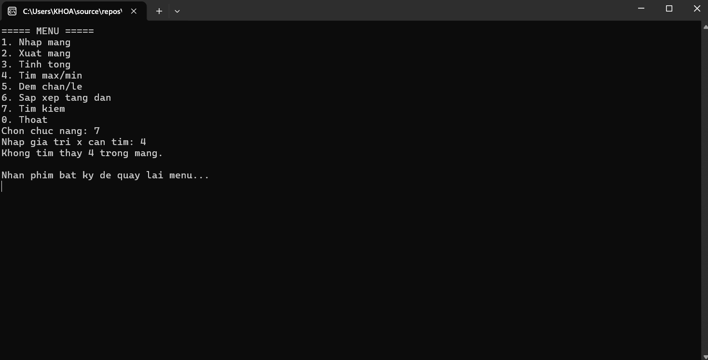
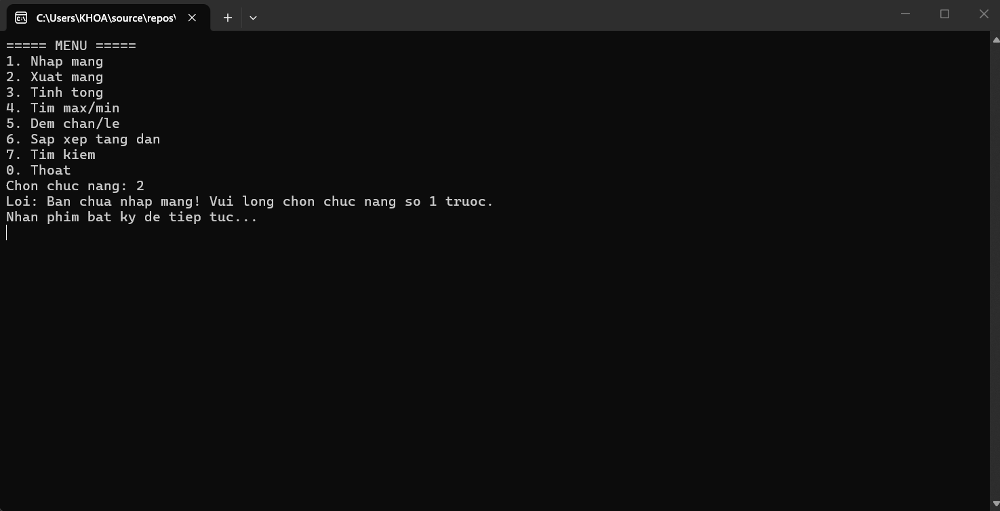
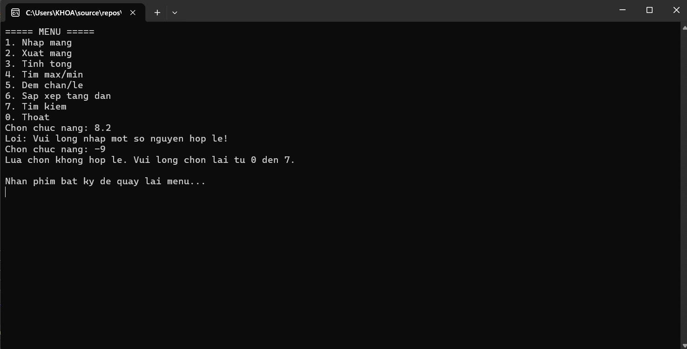

# 2611COMP101904 - Lập trình trên Windows
## Lab 02: C# cơ bản - Quản lý mảng số nguyên bằng Console

**Họ và tên:** Phùng Đăng Khoa
**MSSV:** 51.01.104.046
**Ngày hoàn thành:** 15/09/2026  

### 1. Mô tả dự án
Chương trình Console Application viết bằng ngôn ngữ C# giúp quản lý và thao tác với một mảng số nguyên. Chương trình cung cấp một hệ thống Menu cho phép người dùng lựa chọn thực hiện các thao tác tính toán một cách linh hoạt.

### 2. Các chức năng đã triển khai
- [x] **1. Nhập mảng:** Cho phép nhập số lượng phần tử `n` (bắt buộc `n > 0`) và nhập từng phần tử.
- [x] **2. Xuất mảng:** In danh sách các phần tử đã nhập.
- [x] **3. Tính tổng:** Tính và hiển thị tổng các phần tử.
- [x] **4. Tìm Max/Min:** Tìm ra giá trị lớn nhất và nhỏ nhất trong mảng.
- [x] **5. Đếm chẵn/lẻ:** Thống kê số lượng phần tử là số chẵn và số lẻ.
- [x] **6. Sắp xếp:** Sắp xếp mảng theo thứ tự tăng dần.
- [x] **7. Tìm kiếm:** Nhập một số `x` và tìm vị trí đầu tiên của `x` xuất hiện trong mảng.
- [x] **Kiểm tra dữ liệu:** Bắt lỗi nhập sai kiểu dữ liệu (chữ cái thay vì số), và chặn các thao tác xử lý nếu mảng chưa được khởi tạo.

### 3. Hình ảnh minh chứng (Screenshots)
*Chạy tính năng Menu và nhập mảng:*

*1. Nhập mảng*

*2. Xuất mảng*

*3. Tính tổng*

*4. Tìm max/min*

*5. Đếm chẵn và lẻ*

*6. Sắp xếp theo thứ tự tăng dần*

*7. Tìm kiếm được và không được*

*Lỗi chưa nhập mảng và lỗi nhập sai số*

