## Thông tin sinh viên
- Họ tên: Phùng Đăng Khoa
- MSSV: 51.01.104.046
- Lớp: 51.01.CNTT.A

## Mô tả
Ứng dụng Console C# quản lý sản phẩm theo phương pháp Lập trình hướng đối tượng (OOP). Dự án áp dụng các kiến thức về Interface, Exception tự tạo, Generic Repository (`Repository<T>`), Delegate/Event (hoặc Action) và Func, cùng với việc xử lý ngoại lệ (try-catch) để đảm bảo chương trình không bị dừng đột ngột.

## Chức năng
Chương trình hoạt động dựa trên Menu điều khiển trong Console với các tính năng:
1. **Thêm sản phẩm**: Nhập mã, tên, đơn giá, số lượng. Bắt lỗi nhập liệu, giá/số lượng âm, và mã bị trùng (phát sinh custom exception).
2. **Xuất danh sách**: In toàn bộ sản phẩm. Thông báo nếu danh sách rỗng.
3. **Tìm theo mã**: Nhập mã sản phẩm, in thông tin nếu tìm thấy.
4. **Tìm theo tên**: Nhập từ khóa, in các sản phẩm có tên chứa từ khóa.
5. **Lọc theo khoảng giá**: Nhập giá nhỏ nhất và lớn nhất, dùng Func<Product,bool> để lọc.
6. **Xóa sản phẩm**: Nhập mã sản phẩm, nếu tồn tại thì xóa và phát event thông báo. Bắt lỗi xóa mã không tồn tại.
7. **Tính tổng giá trị kho**: Tính tổng = đơn giá * số lượng của tất cả sản phẩm.
0. **Thoát**: Kết thúc chương trình.

## Cấu trúc class (OOP)
- `IEntity`: Interface ràng buộc cho Generic Repository.
- `Product`: Class chứa thông tin sản phẩm (Id, Tên, Giá, Số lượng) và logic kiểm tra giá/số lượng không được âm.
- `DuplicateProductException` & `ProductNotFoundException`: Các class Custom Exception tự tạo.
- `Repository<T>`: Generic class quản lý danh sách đối tượng, xử lý logic Thêm, Xóa, Tìm, Lọc.
- `ProductService`: Class dịch vụ chứa logic nghiệp vụ, gọi Repository, và phát ra các Event (Action) khi thêm/xóa thành công.
- `Program`: Chứa hàm `Main`, điều khiển menu, giao tiếp người dùng và bắt lỗi (try-catch).

## Cách chạy
- Mở project bằng Visual Studio.
- Nhấn `F5` (hoặc nút Start) để build và chạy ứng dụng.
- Tương tác với chương trình bằng cách nhập các số từ `0` đến `7` trên cửa sổ Console.

## Hình ảnh mô tả chức năng và lỗi

**0. Giao diện**
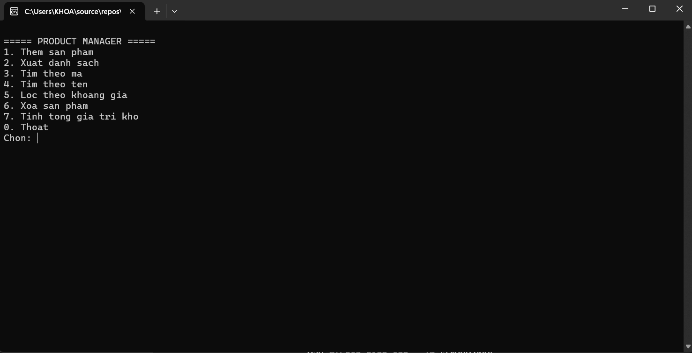

**1. Thêm sản phẩm thành công**
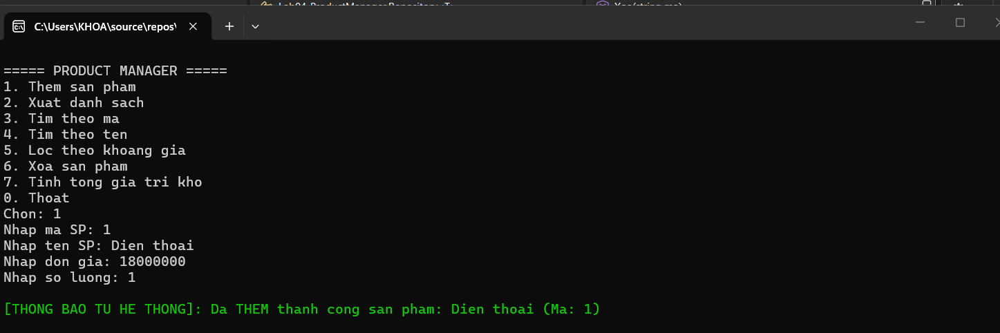

**2. Xuất danh sách**
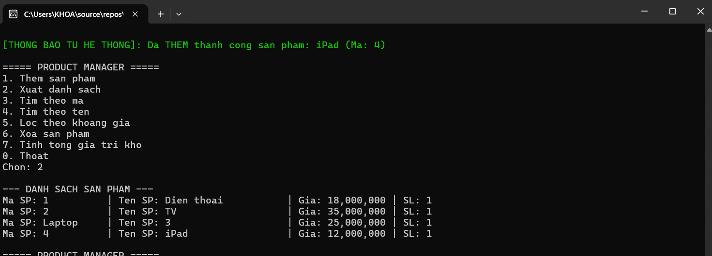

**3. Tìm theo mã**
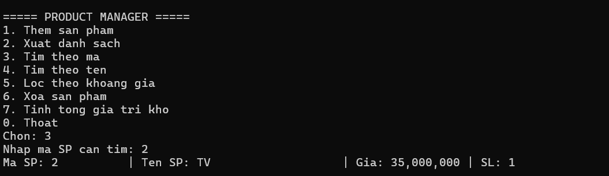

**4. Tìm theo tên**
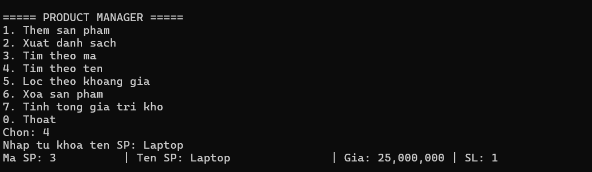

**5. Lọc theo khoảng giá**
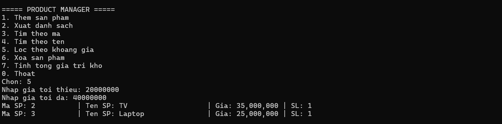

**6. Xóa sản phẩm**
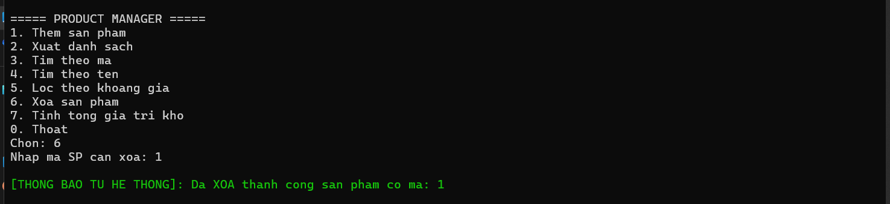

**7. Tính tổng giá trị kho**
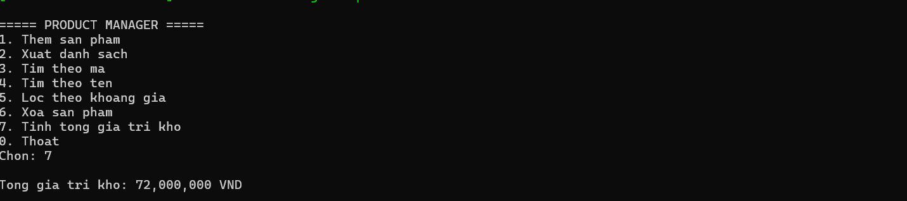

**Kiểm tra dữ liệu: Lỗi thêm sản phẩm trùng mã**
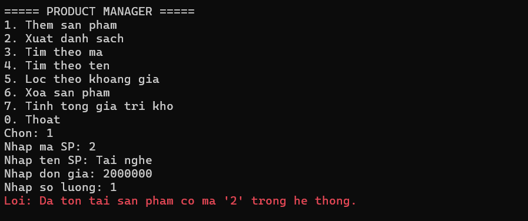

**Kiểm tra dữ liệu: Lỗi xóa sản phẩm không tồn tại**
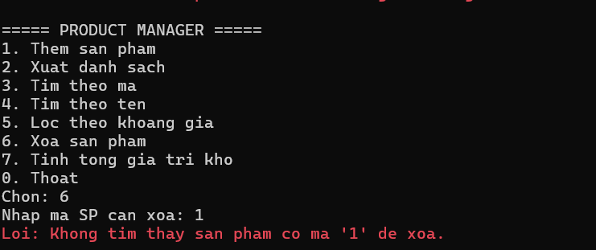

**Kiểm tra dữ liệu: Lỗi nhập giá hoặc số lượng âm**
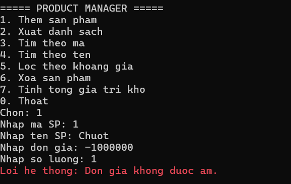

**Kiểm tra dữ liệu: Lỗi nhập sai định dạng dữ liệu**
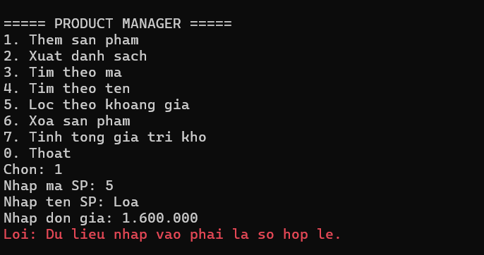
